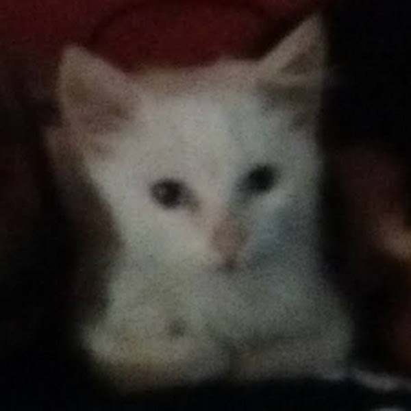
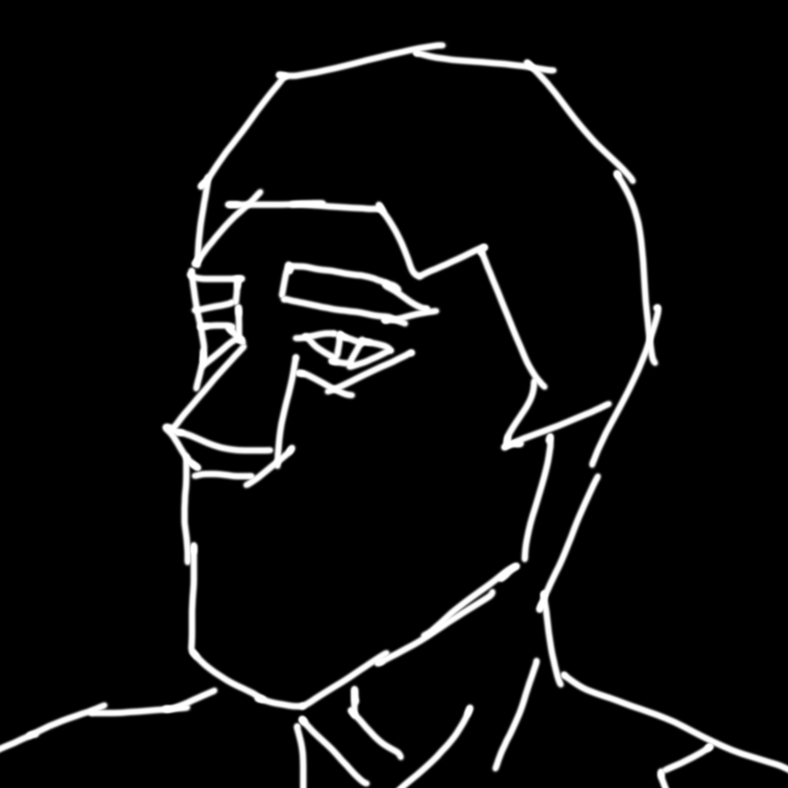
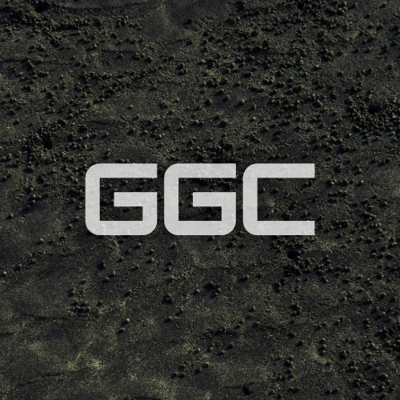

	
	
	<h1 align="center">Guilherme Lemos</h1>
	
coolergate / panicq

	

		
	

### Socials

- [Twitter](https://twitter.com/coolergate2031)
- [YouTube](https://www.youtube.com/channel/UC36-qTyGk7OaYubastOGiqQ)
- [Steam](https://steamcommunity.com/id/panicq)
- [Twitch](https://www.twitch.tv/coolergate) (rarely stream)
- [Discord](https://discord.com/users/277568923019509760)
- [RBX TalentHub](https://talent.roblox.com/creators/83009214)

	

### Programming languages

- C#
- C++
- Lua
- TypeScript

### Languages

- Brazilian Portuguese
- Spanish
- English
- Russian

 

